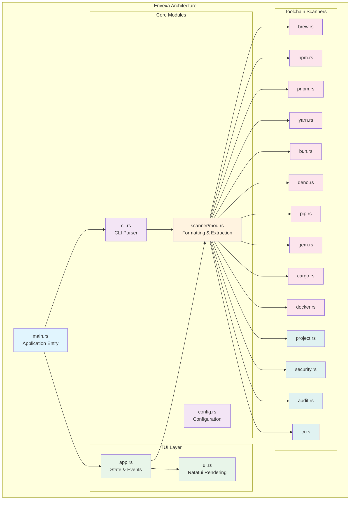
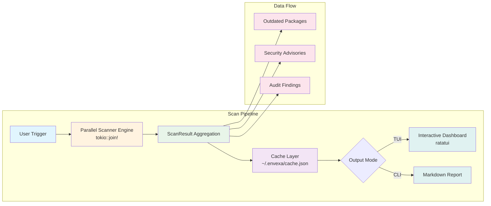

<p align="center">
  
</p>

<h1 align="center">🚧 Envexa</h1>

<p align="center">
  <strong>Blazing-fast Rust TUI and CLI for monitoring local developer tooling health</strong>
</p>

<p align="center">
  
</p>

---

A blazing-fast Rust TUI and scriptable CLI for monitoring local developer tooling health. Instantly track outdated packages and audit security risks across 14+ toolchains.

## 📚 Table of Contents

- [🚀 Quick Start](#-quick-start)
- [✨ Features](#-features)
- [🏗️ Architecture](#-architecture)
- [🧑‍💻 Development](#-development)
- [🤝 Contributing](#-contributing)
- [⚖️ License](#-license)

---

## 🚀 Quick Start

### Install
```bash
# One-line install
curl -fsSL https://raw.githubusercontent.com/KurutoDenzeru/envexa/main/scripts/install.sh | bash

# Or build from source
git clone https://github.com/KurutoDenzeru/envexa.git && cd envexa && cargo install --path .
```

### Usage
```bash
envexa             # Launch the interactive TUI dashboard
envexa scan        # Generate a comprehensive markdown report
envexa update      # Update to the latest release
```

---

## ✨ Features

- **Concurrent Engine**: Scans 14+ toolchains (Homebrew, npm, Cargo, Docker, etc.) in parallel.
- **Interactive TUI**: Features custom pie charts, health gauges, and quick keyboard navigation.
- **Project Tooling Sector**: Deep-dives into local lockfiles, dependency drift, and security audits.
- **CLI Reports**: Generates production-ready Markdown reports instantly for CI/CD or PRs.
- **Smart Cache**: Zero-friction launches utilizing local JSON state (`~/.envexa/cache.json`).

---

## 🧑‍💻 Development

```bash
cargo run           # Launch interactive TUI in terminal
cargo run -- scan   # Run CLI report mode
cargo watch -x run  # Live reloading for TUI
```

Before submitting changes, ensure you run:
```bash
cargo clippy -- -D warnings && cargo fmt --check
```

---

## 🏗️ Architecture

```text
envexa/
├── Cargo.toml
├── src/
│   ├── main.rs             # Application entrypoint (TUI or CLI router)
│   ├── cli.rs              # CLI command parser and runner
│   ├── config.rs           # Persistent configurations and cached state
│   ├── scanner/
│   │   └── mod.rs          # Formatting utilities and diagnostic extraction
│   ├── tui/
│   │   ├── app.rs          # App state management, keyboard events, and scheduler
│   │   ├── mod.rs
│   │   └── ui.rs           # Ratatui rendering pipeline and interface structures
│   └── toolchains/
│       ├── mod.rs          # ScanResult schema, protocols, and multi-thread runners
│       ├── brew.rs
│       ├── npm.rs / pnpm.rs / yarn.rs / bun.rs / deno.rs
│       ├── pip.rs / gem.rs / cargo.rs / docker.rs
│       └── project.rs / security.rs / audit.rs / ci.rs
├── scripts/
│   ├── install.sh
│   └── build-and-upload.sh
└── .github/
    └── workflows/
```

Individual scanner modules are kept highly isolated. Each scanner implements a single `pub async fn scan() -> ScanResult` function, executes in parallel, and handles missing CLI tools gracefully to prevent crashes.

### System Overview





---

## 🤝 Contributing

Contributions are always welcome, whether you're fixing bugs, improving docs, or shipping new features that make the project better for everyone.

Check out [Contributing.md](Contributing) to learn how to get started and follow the recommended workflow.

---

## ⚖️ License

This project is released under the MIT License, giving you the freedom to use, modify, and distribute the code with minimal restrictions.

For the full legal text, see the [MIT](LICENSE) file.
