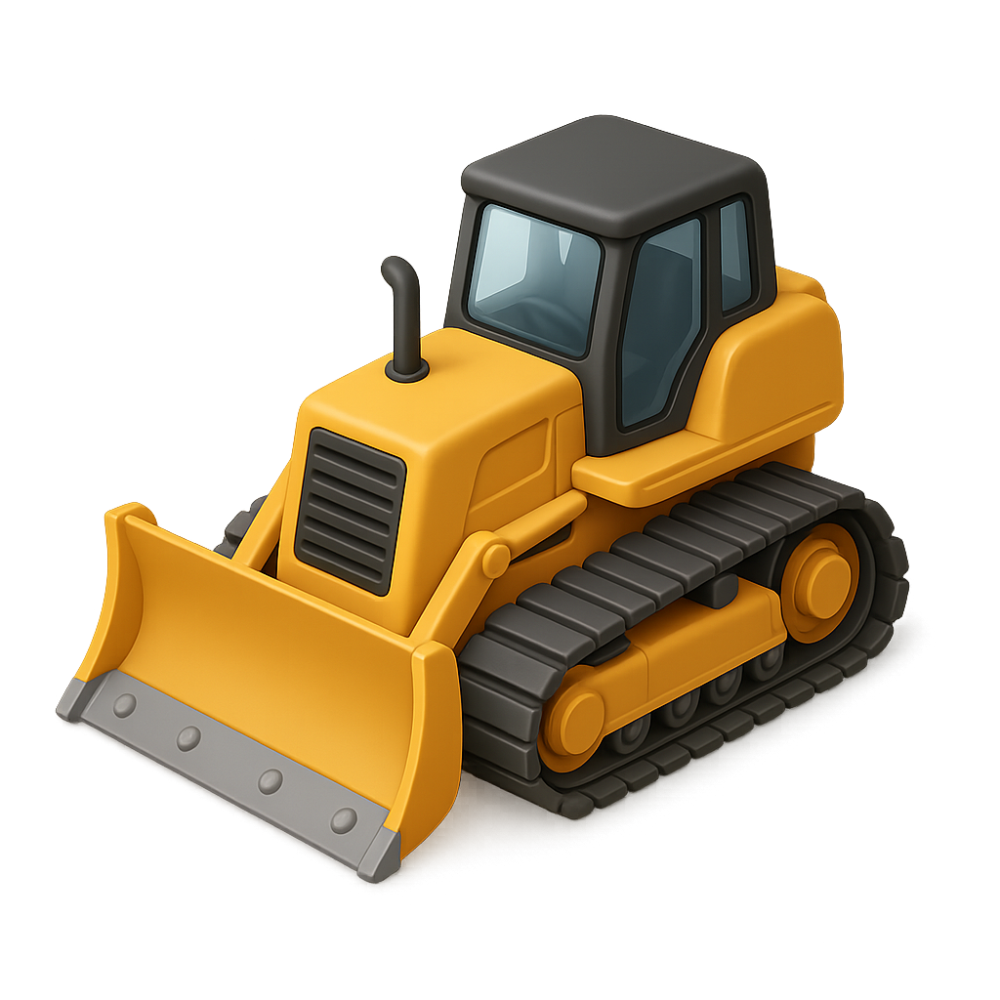
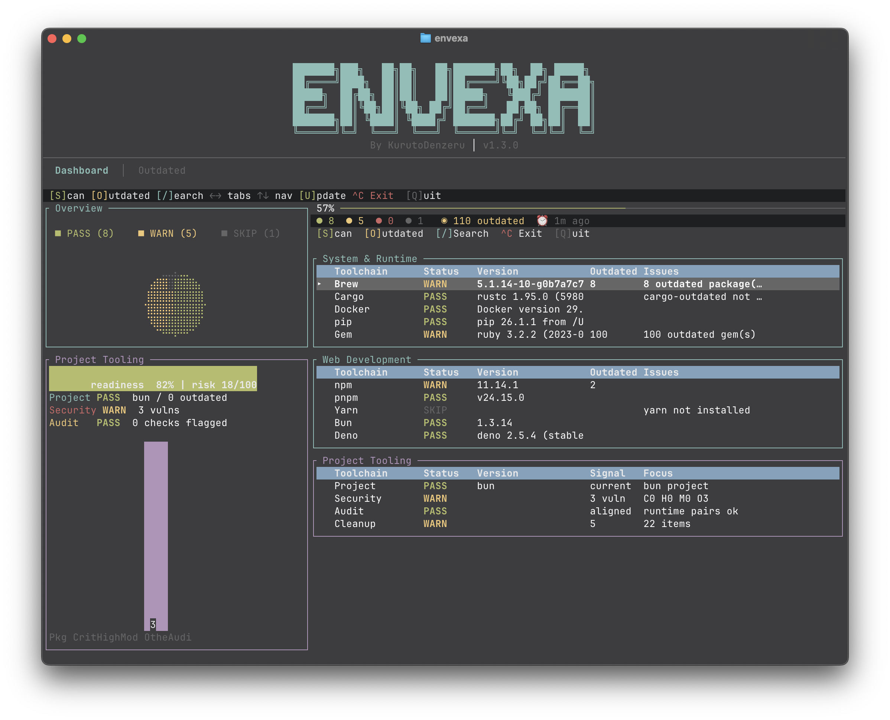
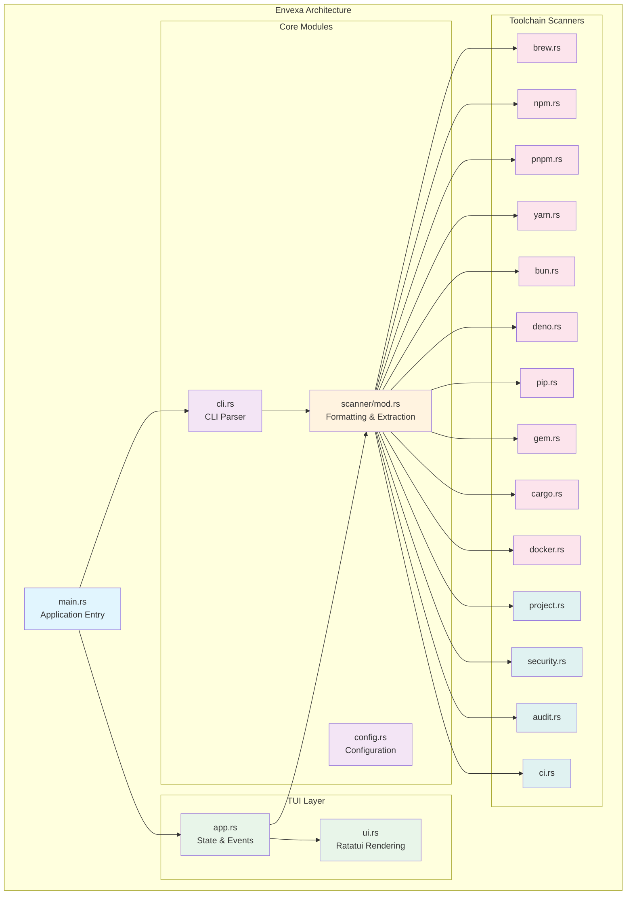
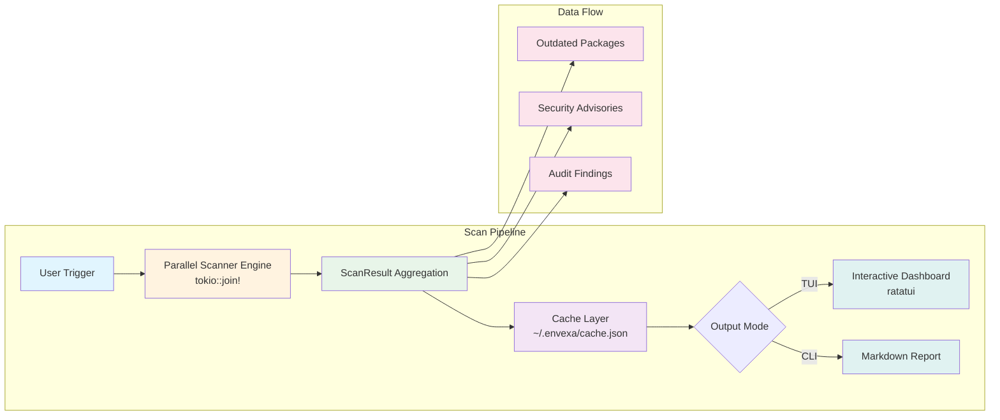

<p align="center">
  
</p>

<h1 align="center">🚧 Envexa</h1>

<p align="center">
  <strong>Blazing-fast Rust TUI and CLI for monitoring local developer tooling health</strong>
</p>

<p align="center">
  
</p>

---

Blazing-fast Rust TUI and CLI that monitors developer tooling health, tracks outdated packages, audits security risks, and reclaims valuable local disk space.

## 📚 Table of Contents

- [Highlights](#-highlights)
- [Install](#-install)
- [Usage](#-usage)
- [TUI](#-tui)
- [Project Tooling Sector](#-project-tooling-sector)
- [Toolchains](#-toolchains)
- [CLI Report](#-cli-report)
- [Cache](#-cache)
- [Development](#-development)
- [Architecture](#-architecture)
- [Design Notes](#-design-notes)
- [Release](#-release)
- [Contributing](#-contributing)
- [License](#-license)

---

## ✨ Highlights

- **Concurrent Engine**: Scans 14+ toolchains in parallel using `tokio::join!`.
- **Interactive TUI**: Implements a highly responsive `ratatui` dashboard featuring custom pie charts, health gauges, real-time activity spinners, and keyboard shortcuts.
- **Project Tooling Sector**: Dedicated checks for project dependencies, security vulnerabilities, and environmental alignment.
- **Scriptable CLI**: Generates production-ready Markdown reports with a single `scan` command.
- **Instant Launch**: Utilizes a JSON-backed local cache (`~/.envexa/cache.json`) to render previous scan states instantly.
- **Zero-Friction Updates**: Integrates a self-update pipeline for native macOS binaries directly from GitHub Releases.

---

## 📦 Install

### One-line install

```bash
curl -fsSL https://raw.githubusercontent.com/KurutoDenzeru/envexa/main/scripts/install.sh | bash
```

The script automatically detects your architecture, downloads the latest release binary, and installs it to `~/.local/bin`.

### Build from source

Requires Rust and Cargo:

```bash
git clone https://github.com/KurutoDenzeru/envexa.git
cd envexa
cargo build --release
cp target/release/envexa ~/.local/bin/
```

---

## 🚀 Usage

```bash
envexa             # Launch the interactive TUI dashboard
envexa scan        # Generate and print a comprehensive markdown report
envexa update      # Check and install the latest GitHub release
envexa --help      # Print command-line options
```

Run `envexa` inside any local project directory to inspect its tooling status. You can customize the default search path in `~/.envexa/config.json`.

---

## 🖥️ TUI

The dashboard features a classic developer-monitoring interface: key metric visualizations on the left, interactive data tables on the right, and shortcut guides at the footer.

| Component | Function |
| :--- | :--- |
| **Overview** | Status distribution (pass/warning/error/skipped) as an interactive pie chart. |
| **Project Tooling** | Live readiness gauge, aggregate risk score, and vulnerability/audit/package distribution. |
| **Health Stats** | Core metrics line displaying system health ratios, outdated package count, and cache age. |
| **Category Tables** | Organized rows for System, Web Development, and Project Tooling packages. |
| **Outdated Tab** | Centralized package update queues supporting individual selection. |
| **Details Pane** | Complete outputs for individual toolchains, security advisories, and audit findings. |

### Keybindings

| Key | Action |
| :--- | :--- |
| `S` | Trigger immediate concurrent scan |
| `O` | Switch to the Outdated packages tab |
| `Enter` | Expand detail pane for the selected dashboard row |
| `/` | Initiate active search/filtering on the current view |
| `Left` / `Right` | Navigate between primary tabs |
| `Up` / `Down` | Browse rows in tables |
| `Space` | Toggle selection for packages supporting updates |
| `Y` | Apply updates for selected package in the detail view |
| `U` | Run batch updates for all selected packages on the Outdated tab |
| `Esc` / `H` | Return to the dashboard home view |
| `Q` / `Ctrl+C` | Quit Envexa |

### Search

Press `/` to instantly filter views:
- **Dashboard**: Filter by toolchain or category name.
- **Outdated**: Filter by package name, toolchain source, or type.

Press `Esc` to clear search or `Enter` to lock the filter in place.

---

## 🧰 Project Tooling Sector

The Project Tooling sector provides a specialized local lens into your active project.

| Scanner | Target Scope |
| :--- | :--- |
| ✨ **Project** | Scans lockfiles (package.json, Cargo.toml, poetry.lock, etc.) and performs dependency drift analysis. |
| 🔐 **Security** | Audits dependencies using language-specific advisory databases (Rust Sec, npm audit, pip-audit). |
| 🧪 **Audit** | Validates runtime parity across toolsets (e.g., verifying Node, npm, Python, pip, and Rust compiler alignment). |
| 🤖 **CI/CD** | Parses GitHub Actions workflows locally (zero-network) to flag outdated CI/CD steps and dependencies. |

Envexa compiles these signals into:
- A dynamic **Readiness Gauge** mapping dependency risk, warning levels, and unpatched security issues.
- A **Signal Bar Chart** categorizing outdated packages and security vulnerabilities by severity.
- Clear, actionable focus logs pointing you to the most critical next remediation step.

---

## 🛠️ Toolchains

### 🖥️ System & Runtime

| Toolchain | Monitored Metrics |
| :--- | :--- |
| **Homebrew** | Version status, formula counts, and outdated global formulae/casks. |
| **pip** | Python & pip compiler versions along with globally outdated packages. |
| **Gem** | Ruby & gem environment version states and outdated global gems. |
| **Cargo** | rustc/Cargo compiler drift and target-specific outdated binaries. |
| **Docker** | Engine/Daemon availability, storage footprint, and system cleanup opportunities. |

### 🌐 Web Development

| Toolchain | Monitored Metrics |
| :--- | :--- |
| **npm** | Node & npm local execution checks, plus global package drift tracking. |
| **pnpm** | Node & pnpm integration checks, plus global package drift tracking. |
| **Yarn** | Node & Yarn package manager availability and version diagnostics. |
| **Bun** | Bun runtime availability and global npm package alignment. |
| **Deno** | Deno engine versions and outdated package diagnostics. |

---

## 📄 CLI Report

Run a complete, non-interactive scan directly in standard output:

```bash
envexa scan
```

The CLI prints a structured Markdown document including:
- High-level system health dashboard
- Complete outdated package queue
- Categorized security vulnerabilities
- Core runtime version audit findings

Perfect for generating PR comments, build logs, and environment documentation in automated environments.

---

## 🗄️ Cache

Envexa stores scan history to accelerate launch times:

```text
~/.envexa/cache.json
```

Cached results have a default TTL of 7 days. On startup, Envexa instantly visualizes cached data and schedules non-blocking background checks or manual scans via the `S` key.

---

## 🧑‍💻 Development

```bash
cargo build         # Compile debug build
cargo run           # Launch interactive TUI in terminal
cargo run -- scan   # Run CLI report mode
cargo run -- --help # Print help instructions
```

For live reloading check:
```bash
cargo install cargo-watch
cargo watch -x check
```

Before submitting changes:

```bash
cargo build
cargo clippy -- -D warnings
cargo fmt --check
```

*Note: For TUI changes, run `cargo run` in a full-sized terminal to manually verify layouts, detail scrolls, navigation, and exit states.*

---

## 🏗️ Architecture

```text
envexa/
├── Cargo.toml
├── src/
│   ├── main.rs             # Application entrypoint (TUI or CLI router)
│   ├── cli.rs              # CLI command parser and runner
│   ├── config.rs           # Persistent configurations and cached state
│   ├── scanner/
│   │   └── mod.rs          # Formatting utilities and diagnostic extraction
│   ├── tui/
│   │   ├── app.rs          # App state management, keyboard events, and scheduler
│   │   ├── mod.rs
│   │   └── ui.rs           # Ratatui rendering pipeline and interface structures
│   └── toolchains/
│       ├── mod.rs          # ScanResult schema, protocols, and multi-thread runners
│       ├── brew.rs
│       ├── npm.rs / pnpm.rs / yarn.rs / bun.rs / deno.rs
│       ├── pip.rs / gem.rs / cargo.rs / docker.rs
│       └── project.rs / security.rs / audit.rs / ci.rs
├── scripts/
│   ├── install.sh
│   └── build-and-upload.sh
└── .github/
    └── workflows/
```

Individual scanner modules are kept highly isolated. Each scanner implements a single `pub async fn scan() -> ScanResult` function, executes in parallel, and handles missing CLI tools gracefully to prevent crashes.

### System Overview





---

## 🎛️ Design Notes

Envexa maximizes the use of built-in `ratatui` UI widgets (like `Table`, `Tabs`, `Gauge`, `LineGauge`, and `BarChart`) for a cohesive look. High-signal third-party integrations include:
- `tui-piechart`: Renders the high-level category distribution on the dashboard.
- `throbber-widgets-tui`: Powering animated spinners during live scanner activity.

All UI components should prioritize actionability. Only introduce widgets that directly assist a developer in resolving drift, securing packages, or reclaiming disk space.

---

## 🚢 Release

Binaries for macOS are built and published through GitHub Releases. For details on versioning guidelines and the release logs template, consult [.github/ISSUE_TEMPLATE/RELEASES.md](.github/ISSUE_TEMPLATE/RELEASES.md).

```bash
cargo clean
# Bump Cargo.toml version and commit changes
git tag vX.Y.Z && git push origin vX.Y.Z
gh release create vX.Y.Z --title "vX.Y.Z" --notes "..."
scripts/build-and-upload.sh vX.Y.Z
gh release view vX.Y.Z --json assets --jq '.assets[].name'
cargo clean
```

---

## 🤝 Contributing

Contributions are always welcome, whether you're fixing bugs, improving docs, or shipping new features that make the project better for everyone.

Check out [Contributing.md](Contributing) to learn how to get started and follow the recommended workflow.

---

## ⚖️ License

This project is released under the MIT License, giving you the freedom to use, modify, and distribute the code with minimal restrictions.

For the full legal text, see the [MIT](LICENSE) file.
