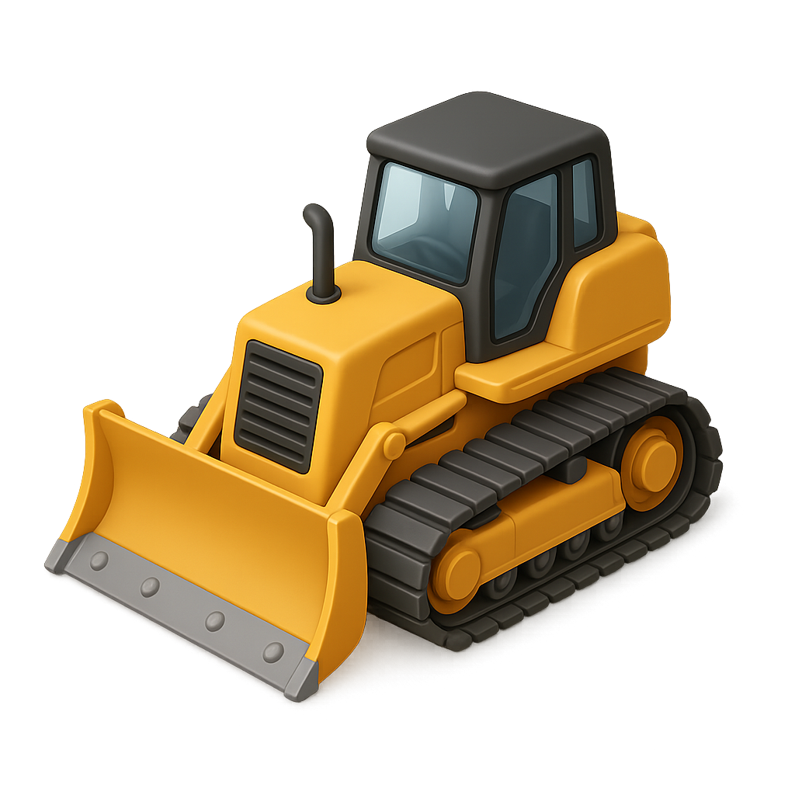
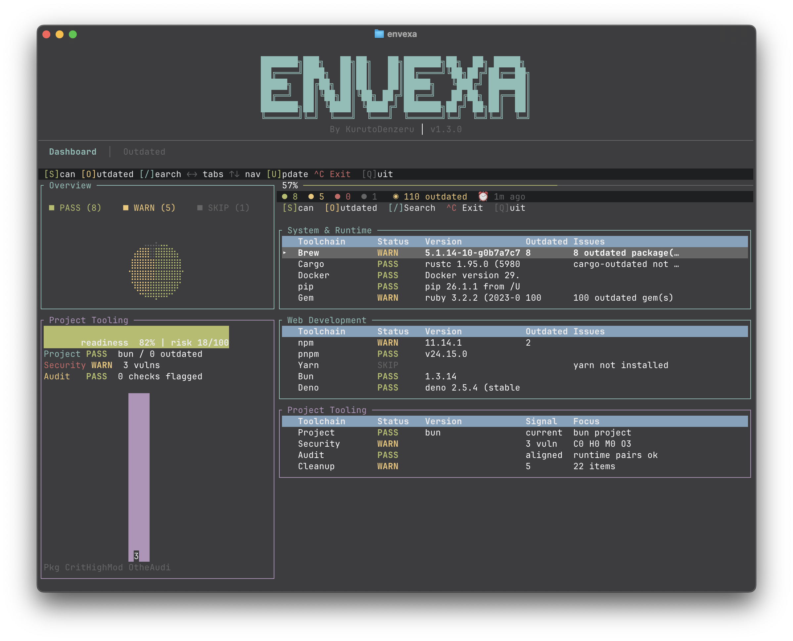
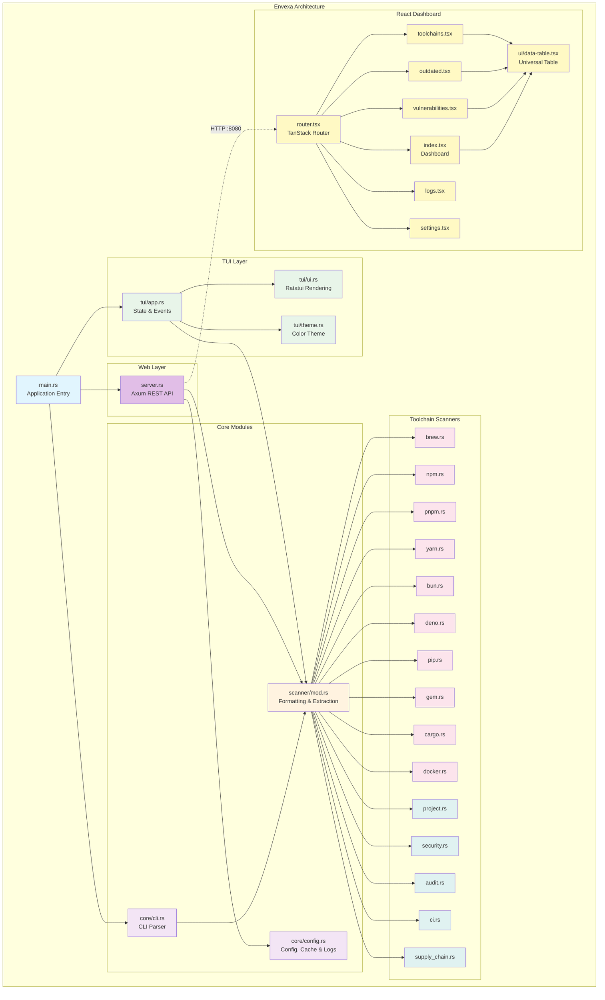
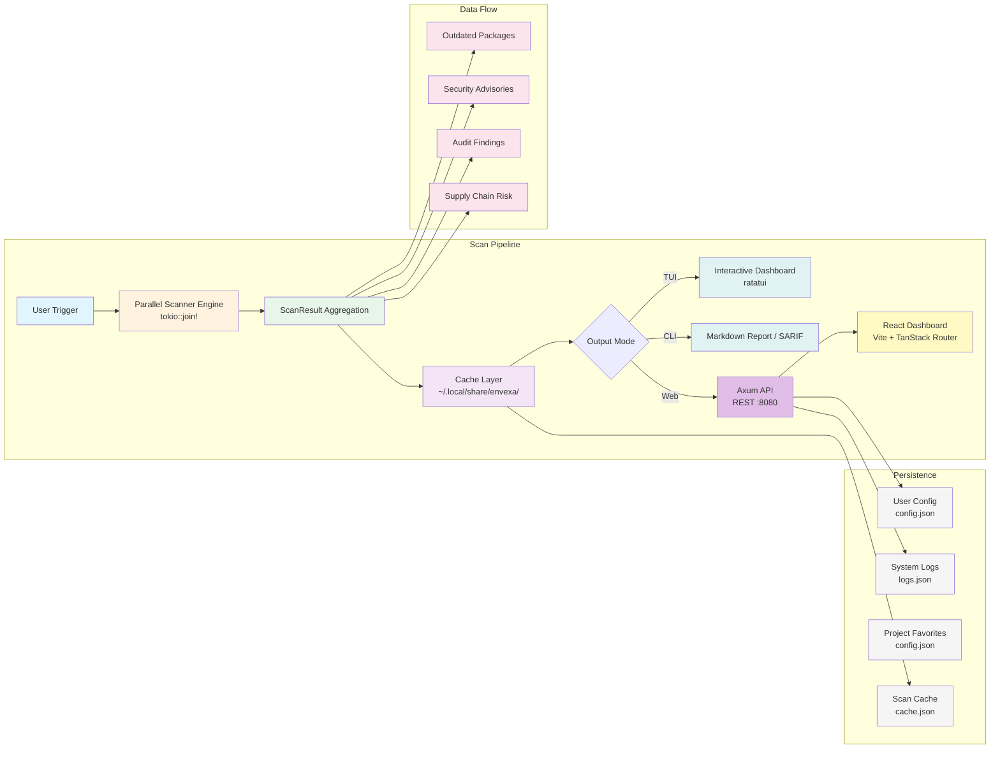

<p align="center">
  
</p>

<h1 align="center">🚧 Envexa</h1>

<p align="center">
  <strong>Blazing-fast Rust TUI, CLI, and Web Dashboard for monitoring local developer tooling health</strong>
</p>

<p align="center">
  
</p>

---

Blazing-fast Rust TUI, scriptable CLI, and Web Dashboard for monitoring local developer tooling health. Instantly track outdated packages, audit security risks across 15 toolchains, and visualize reports in an interactive web interface.

## 📚 Table of Contents

- [🚀 Quick Start](#-quick-start)
- [✨ Features](#-features)
- [🏗️ Architecture](#-architecture)
- [🧑‍💻 Development](#-development)
- [🤝 Contributing](#-contributing)
- [⚖️ License](#-license)

---

## 🚀 Quick Start

### Install
```bash
# One-line install
curl -fsSL https://raw.githubusercontent.com/KurutoDenzeru/envexa/main/scripts/install.sh | bash

# Or build from source
git clone https://github.com/KurutoDenzeru/envexa.git && cd envexa && cargo install --path .
```

### Usage
```bash
envexa             # Launch the interactive TUI dashboard
envexa scan        # Generate a comprehensive markdown report
envexa serve       # Launch the interactive Web Dashboard (port 8080)
envexa update      # Update to the latest release
```

---

## ✨ Features

- **Concurrent Engine**: Scans 15 toolchains (Homebrew, npm, Cargo, Docker, etc.) in parallel.
- **Interactive TUI**: Custom pie charts, health gauges, quick keyboard navigation, and system logs viewer.
- **Web Dashboard** (React/Vite/TypeScript): Feature-rich web UI with Axum API backend. Includes dashboard overview, vulnerability management, outdated package tracking, toolchain inspection, settings persistence, and real-time system logs.
- **Project Tooling Sector**: Deep-dives into local lockfiles, dependency drift, and security audits.
- **CLI Reports**: Generates production-ready Markdown reports instantly for CI/CD or PRs.
- **Smart Cache**: Zero-friction launches utilizing local JSON state (`~/.local/share/envexa/cache.json`). Logs persist across sessions with configurable retention.

---

## 🧑‍💻 Development

### Backend (Rust)
```bash
cargo run           # Launch interactive TUI in terminal
cargo run -- scan   # Run CLI report mode
cargo run -- serve  # Launch Web API server on port 8080
cargo watch -x run  # Live reloading for TUI
```

### Frontend (React)
```bash
cd frontend
bun install         # Install dependencies
bun run dev         # Start Vite dev server (proxies API to :8080)
bun run build       # Production build
bun run typecheck   # TypeScript check
```

Before submitting changes, ensure you run:
```bash
# Rust
cargo clippy -- -D warnings && cargo fmt --check

# Frontend (if applicable)
cd frontend && bun run typecheck && bun run build
```

---

## 🏗️ Architecture

```text
envexa/
├── Cargo.toml
├── src/
│   ├── main.rs             # Application entrypoint (TUI, CLI, or server router)
│   ├── lib.rs              # Shared library root
│   ├── bin/
│   │   └── benchmark.rs    # Scanner benchmark harness
│   ├── core/
│   │   ├── mod.rs          # Core module exports
│   │   ├── cli.rs          # CLI command parser and runner
│   │   └── config.rs       # Persistent config, cache, logs
│   ├── server.rs           # Axum web API server (REST endpoints)
│   ├── scanner/
│   │   ├── mod.rs          # Formatting utilities and diagnostic extraction
│   │   └── sarif.rs        # SARIF report generation
│   ├── tui/
│   │   ├── mod.rs
│   │   ├── app.rs          # App state management, keyboard events, scheduler
│   │   ├── theme.rs        # TUI color theme definitions
│   │   └── ui.rs           # Ratatui rendering pipeline
│   └── toolchains/
│       ├── mod.rs          # ScanResult schema, protocol, parallel runner
│       ├── brew.rs / npm.rs / pnpm.rs / yarn.rs / bun.rs / deno.rs
│       ├── pip.rs / gem.rs / cargo.rs / docker.rs
│       └── project.rs / security.rs / audit.rs / ci.rs / supply_chain.rs
├── frontend/
│   ├── package.json        # React 19 / Vite / TypeScript
│   ├── vite.config.ts      # Vite config with API proxy
│   ├── tsconfig.json
│   ├── components.json     # shadcn/ui registry
│   ├── bun-dev-server.ts   # Dev server entry
│   └── src/
│       ├── main.tsx        # App entry, providers, router
│       ├── router.tsx      # TanStack Router configuration
│       ├── routeTree.gen.ts# Auto-generated route tree
│       ├── styles.css      # Tailwind CSS entry
│       ├── lib/
│       │   └── utils.ts    # Utility functions
│       ├── hooks/
│       │   └── use-mobile.ts # Mobile detection hook
│       ├── components/
│       │   ├── app-sidebar.tsx         # Sidebar navigation
│       │   ├── theme-provider.tsx      # Theme (light/dark/system)
│       │   ├── scan-data-context.tsx    # Shared scan state context
│       │   ├── scan-progress.tsx        # Per-toolchain scan animation
│       │   ├── project-path-selector.tsx# Directory browser + favorites
│       │   ├── package-detail-dialog.tsx# 4-tab package inspection
│       │   └── ui/                     # shadcn/ui primitives
│       │       ├── badge.tsx / button.tsx / card.tsx / chart.tsx
│       │       ├── data-table.tsx      # Universal sortable/paginated table
│       │       ├── dialog.tsx / tabs.tsx / tooltip.tsx
│       │       └── … (30+ primitives)
│       └── routes/
│           ├── __root.tsx          # Root layout with sidebar + navbar
│           ├── index.tsx           # Dashboard overview (risk, charts, grid)
│           ├── vulnerabilities.tsx # Vulnerability listing with severity chart
│           ├── outdated.tsx        # Outdated packages with update checks
│           ├── toolchains.tsx      # Toolchain status grid/detail dialog
│           ├── logs.tsx            # System log viewer with terminal
│           └── settings.tsx        # Settings (scanners, theme, config, about)
├── scripts/
│   ├── install.sh
│   └── build-and-upload.sh
├── tests/
│   ├── integration_tests.rs
│   └── parser_tests.rs
└── .github/
    ├── pull_request_template.md
    └── workflows/
```

Individual scanner modules are kept highly isolated. Each scanner implements a single `pub async fn scan() -> ScanResult` function, executes in parallel, and handles missing CLI tools gracefully to prevent crashes.

### System Overview


```mermaid
graph TB
    subgraph "Envexa Architecture"
        Main[main.rs<br/>Application Entry]

        subgraph "Core Modules"
            CLI[core/cli.rs<br/>CLI Parser]
            Config[core/config.rs<br/>Config, Cache & Logs]
            Scanner[scanner/mod.rs<br/>Formatting & Extraction]
        end

        subgraph "TUI Layer"
            App[tui/app.rs<br/>State & Events]
            UI[tui/ui.rs<br/>Ratatui Rendering]
            Theme[tui/theme.rs<br/>Color Theme]
        end

        subgraph "Web Layer"
            Server[server.rs<br/>Axum REST API]
        end

        subgraph "Toolchain Scanners"
            direction LR
            Brew[brew.rs]
            NPM[npm.rs]
            Pnpm[pnpm.rs]
            Yarn[yarn.rs]
            Bun[bun.rs]
            Deno[deno.rs]
            Pip[pip.rs]
            Gem[gem.rs]
            Cargo[cargo.rs]
            Docker[docker.rs]
            Project[project.rs]
            Security[security.rs]
            Audit[audit.rs]
            CI[ci.rs]
            SupplyChain[supply_chain.rs]
        end

        subgraph "React Dashboard"
            Router[router.tsx<br/>TanStack Router]
            Overview[index.tsx<br/>Dashboard]
            Vulns[vulnerabilities.tsx]
            Outdated[outdated.tsx]
            Toolchains[toolchains.tsx]
            Logs[logs.tsx]
            Settings[settings.tsx]
            DataTable[ui/data-table.tsx<br/>Universal Table]
        end
    end

    Main --> CLI
    Main --> App
    Main --> Server
    CLI --> Scanner
    App --> UI
    App --> Theme
    App --> Scanner
    Server --> Scanner
    Server --> Config

    Scanner --> Brew
    Scanner --> NPM
    Scanner --> Pnpm
    Scanner --> Yarn
    Scanner --> Bun
    Scanner --> Deno
    Scanner --> Pip
    Scanner --> Gem
    Scanner --> Cargo
    Scanner --> Docker
    Scanner --> Project
    Scanner --> Security
    Scanner --> Audit
    Scanner --> CI
    Scanner --> SupplyChain

    Server -.->|HTTP :8080| Router
    Router --> Overview
    Router --> Vulns
    Router --> Outdated
    Router --> Toolchains
    Router --> Logs
    Router --> Settings

    Overview --> DataTable
    Vulns --> DataTable
    Outdated --> DataTable
    Toolchains --> DataTable

    style Main fill:#e1f5fe
    style CLI fill:#f3e5f5
    style Config fill:#f3e5f5
    style Scanner fill:#fff3e0
    style App fill:#e8f5e9
    style UI fill:#e8f5e9
    style Theme fill:#e8f5e9
    style Server fill:#e1bee7
    style Brew fill:#fce4ec
    style NPM fill:#fce4ec
    style Pnpm fill:#fce4ec
    style Yarn fill:#fce4ec
    style Bun fill:#fce4ec
    style Deno fill:#fce4ec
    style Pip fill:#fce4ec
    style Gem fill:#fce4ec
    style Cargo fill:#fce4ec
    style Docker fill:#fce4ec
    style Project fill:#e0f2f1
    style Security fill:#e0f2f1
    style Audit fill:#e0f2f1
    style CI fill:#e0f2f1
    style SupplyChain fill:#e0f2f1
    style Router fill:#fff9c4
    style Overview fill:#fff9c4
    style Vulns fill:#fff9c4
    style Outdated fill:#fff9c4
    style Toolchains fill:#fff9c4
    style Logs fill:#fff9c4
    style Settings fill:#fff9c4
    style DataTable fill:#fff9c4
```


```mermaid
graph LR
    subgraph "Scan Pipeline"
        Input[User Trigger] --> Parallel[Parallel Scanner Engine<br/>tokio::join!]
        Parallel --> Results[ScanResult Aggregation]
        Results --> Cache[Cache Layer<br/>~/.local/share/envexa/]
        Cache --> Output{Output Mode}
        Output -->|TUI| Dashboard[Interactive Dashboard<br/>ratatui]
        Output -->|CLI| Report[Markdown Report / SARIF]
        Output -->|Web| API[Axum API<br/>REST :8080]
        API --> Frontend[React Dashboard<br/>Vite + TanStack Router]
    end

    subgraph "Data Flow"
        Results --> Outdated[Outdated Packages]
        Results --> Security[Security Advisories]
        Results --> Audit[Audit Findings]
        Results --> SupplyChain[Supply Chain Risk]
    end

    subgraph "Persistence"
        Config[User Config<br/>config.json]
        Logs[System Logs<br/>logs.json]
        Favorites[Project Favorites<br/>config.json]
        Cache2[Scan Cache<br/>cache.json]
    end

    Cache --> Cache2
    API --> Config
    API --> Logs

    style Input fill:#e1f5fe
    style Parallel fill:#fff3e0
    style Results fill:#e8f5e9
    style Cache fill:#f3e5f5
    style Dashboard fill:#e0f2f1
    style Report fill:#e0f2f1
    style API fill:#e1bee7
    style Frontend fill:#fff9c4
    style Outdated fill:#fce4ec
    style Security fill:#fce4ec
    style Audit fill:#fce4ec
    style SupplyChain fill:#fce4ec
    style Config fill:#f5f5f5
    style Logs fill:#f5f5f5
    style Favorites fill:#f5f5f5
    style Cache2 fill:#f5f5f5
```

---

## 🤝 Contributing

Contributions are always welcome, whether you're fixing bugs, improving docs, or shipping new features that make the project better for everyone.

Check out [Contributing.md](Contributing) to learn how to get started and follow the recommended workflow.

---

## ⚖️ License

This project is released under the MIT License, giving you the freedom to use, modify, and distribute the code with minimal restrictions.

For the full legal text, see the [MIT](LICENSE) file.
